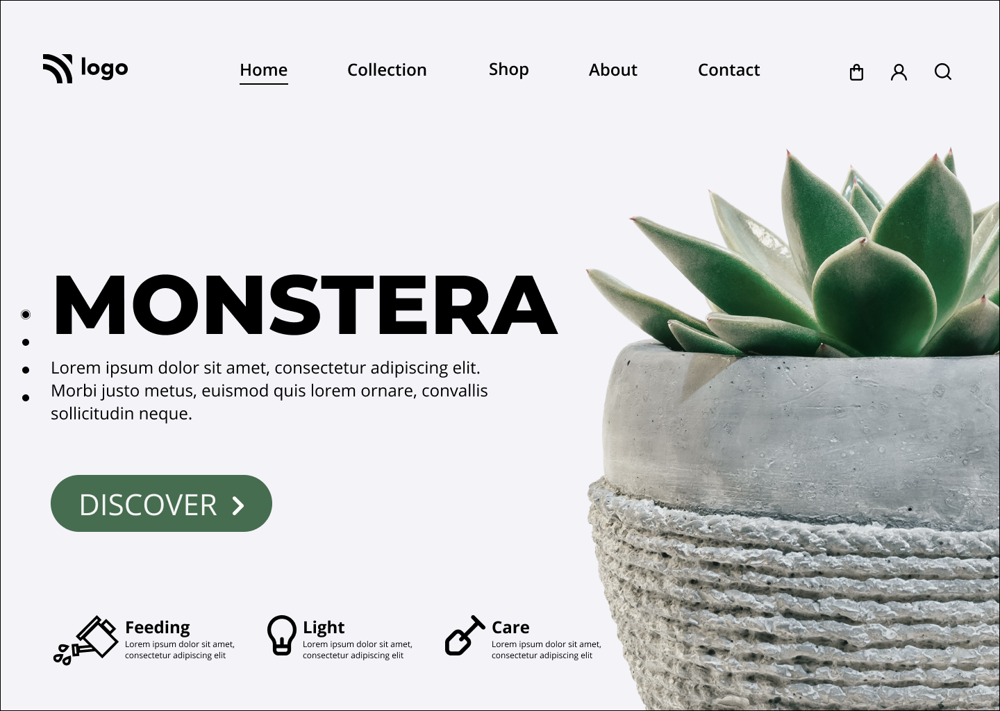

### Explore Nature's Bounty: Plant Shopping Webpage

This project developed with pure HTML and CSS mainly focused on positions.

[Plant Shopping Webpage](https://plant-homepagee.netlify.app/)

 
 

Welcome to our Plant Shopping Webpage, an online haven for plant enthusiasts and nature lovers. Hosted on Netlify, this project is designed to offer a delightful and convenient experience for users looking to bring the beauty of nature into their homes.

### Technologies Used
 

HTML and CSS:
The foundation of our project, HTML and CSS collaborate to create an aesthetically pleasing and user-friendly interface.

Netlify Hosting:
Leveraging the power of Netlify for seamless deployment, hosting, and continuous integration, ensuring a reliable and scalable platform.

### Demo :

### You can Check it Live on Below Link :

[Live Link !](https://plant-homepagee.netlify.app/)
